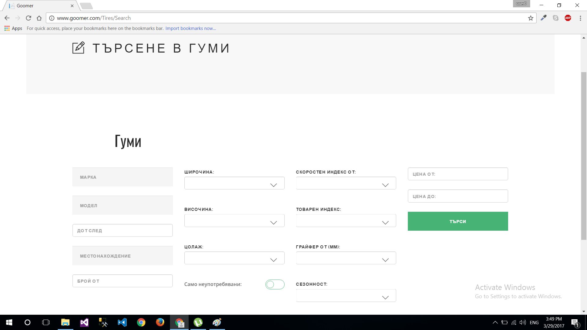
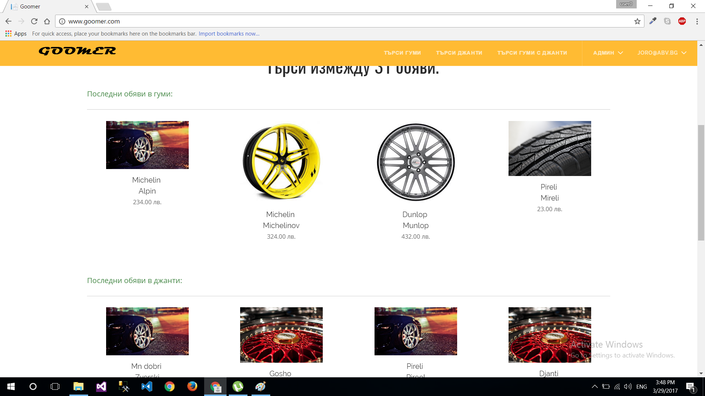
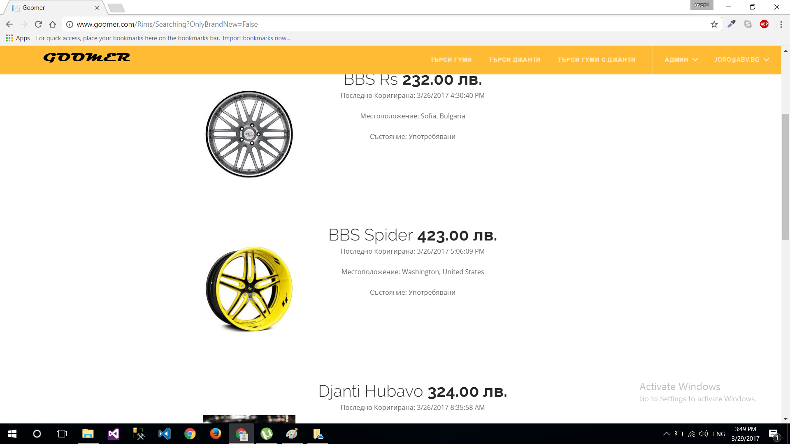

# Goomer

# Main functionality
- Users can search trough tires and rims ads with detailed search
- Users can add new ads for tires and rims
- Users can search and add in tree different categories: tires, rims and rims with tires
- Admins can manages users

# Technologies
- ASP.NET MVC
- Razor views
- jQuery
- SQL Server 2016
- Entity Framework 6
- Ninject (DI Container)
- Automapper
- KendoUI
- SignalR

# Screenshots

|                                               |                                              |
| -----------------------------------           |:--------------------------------------------:|   
|          |                            |
|          |                            |
     
